# TradingAgents Architecture Diagrams

## Table of Contents

1. [System Overview](#system-overview)
2. [Component Architecture](#component-architecture)
3. [Agent Workflow](#agent-workflow)
4. [Data Flow Architecture](#data-flow-architecture)
5. [State Management](#state-management)
6. [LLM Integration](#llm-integration)
7. [Deployment Architecture](#deployment-architecture)

## System Overview

### High-Level System Architecture

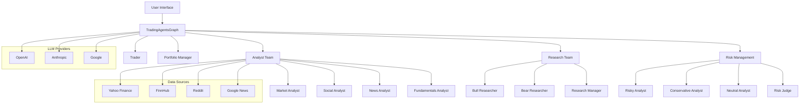

### Trading Decision Pipeline

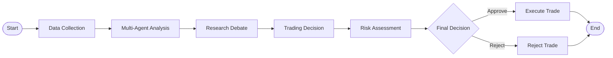

## Component Architecture

### Core Framework Components

```mermaid
graph TB
    subgraph "TradingAgents Framework"
        subgraph "Orchestration Layer"
            TG[TradingAgentsGraph]
            GS[GraphSetup]
            CL[ConditionalLogic]
            PR[Propagator]
        end
        
        subgraph "Agent Layer"
            subgraph "Analysts"
                MA[Market Analyst]
                SA[Social Analyst]
                NA[News Analyst]
                FA[Fundamentals Analyst]
            end
            
            subgraph "Research Team"
                BR[Bull Researcher]
                BE[Bear Researcher]
                RM[Research Manager]
            end
            
            subgraph "Trading Team"
                TR[Trader]
            end
            
            subgraph "Risk Management"
                RA[Risky Analyst]
                CA[Conservative Analyst]
                NEU[Neutral Analyst]
                RJ[Risk Judge]
            end
        end
        
        subgraph "Data Layer"
            IF[Interface]
            YU[YFin Utils]
            FU[FinnHub Utils]
            RU[Reddit Utils]
            GU[GoogleNews Utils]
        end
        
        subgraph "State Management"
            AS[AgentState]
            IDS[InvestDebateState]
            RDS[RiskDebateState]
            MEM[Memory Systems]
        end
    end
    
    TG --> GS
    GS --> CL
    GS --> Analysts
    GS --> "Research Team"
    GS --> "Trading Team"
    GS --> "Risk Management"
    
    Analysts --> IF
    IF --> YU
    IF --> FU
    IF --> RU
    IF --> GU
    
    TG --> AS
    "Research Team" --> IDS
    "Risk Management" --> RDS
    Analysts --> MEM
```

### Module Dependencies

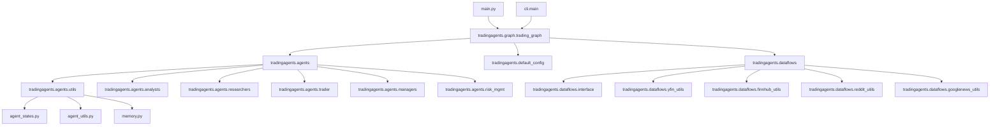

## Agent Workflow

### Complete Agent Execution Flow

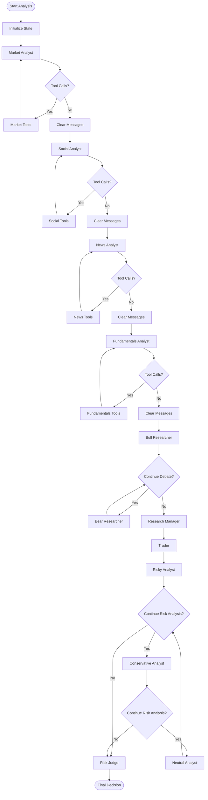

### Research Debate Flow

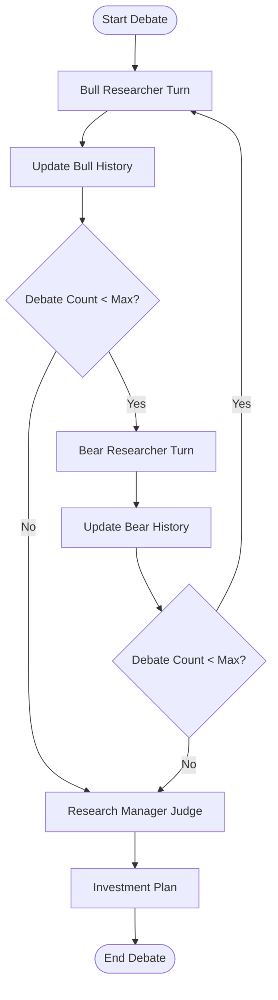

### Risk Assessment Flow

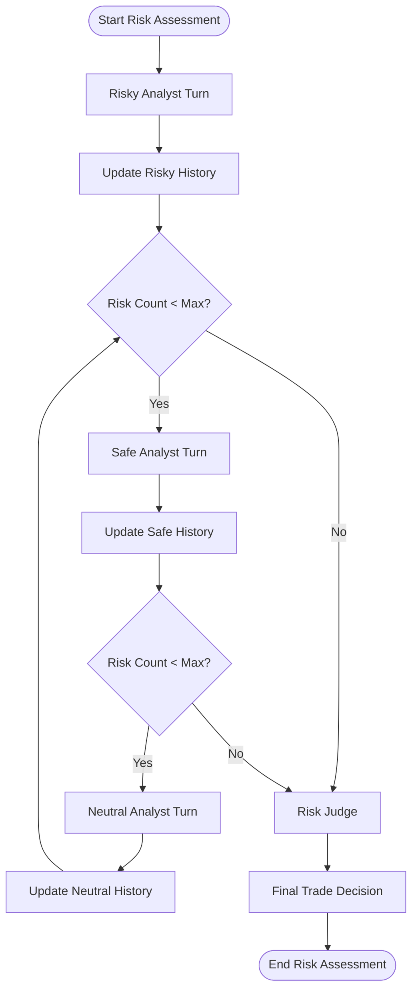

## Data Flow Architecture

### Data Source Integration

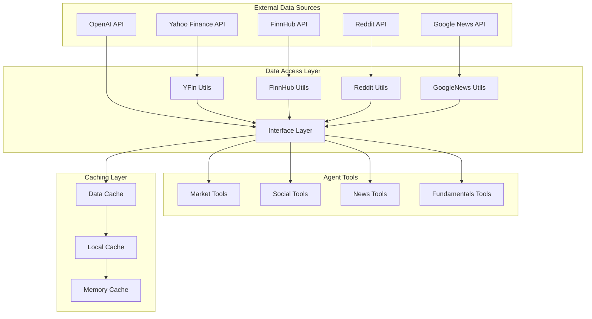

### Data Processing Pipeline

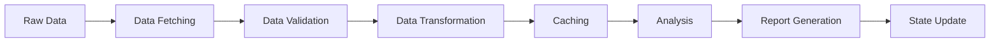

### Tool Node Architecture

```mermaid
graph TB
    subgraph "Market Tool Node"
        YFOnline[get_YFin_data_online]
        YFOffline[get_YFin_data]
        SSOnline[get_stockstats_indicators_report_online]
        SSOffline[get_stockstats_indicators_report]
    end
    
    subgraph "Social Tool Node"
        SONOnline[get_stock_news_openai]
        RDOffline[get_reddit_stock_info]
    end
    
    subgraph "News Tool Node"
        GNOnline[get_global_news_openai]
        GoogleNews[get_google_news]
        FHNews[get_finnhub_news]
        RDNews[get_reddit_news]
    end
    
    subgraph "Fundamentals Tool Node"
        FOnline[get_fundamentals_openai]
        FHInsider[get_finnhub_company_insider_sentiment]
        FHTransactions[get_finnhub_company_insider_transactions]
        SimFinBalance[get_simfin_balance_sheet]
        SimFinCash[get_simfin_cashflow]
        SimFinIncome[get_simfin_income_stmt]
    end
    
    MA[Market Analyst] --> "Market Tool Node"
    SA[Social Analyst] --> "Social Tool Node"
    NA[News Analyst] --> "News Tool Node"
    FA[Fundamentals Analyst] --> "Fundamentals Tool Node"
```

## State Management

### State Evolution Through Pipeline

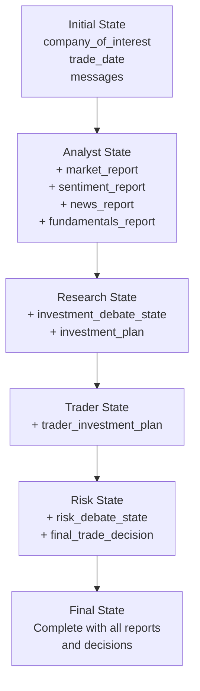

### State Structure Hierarchy

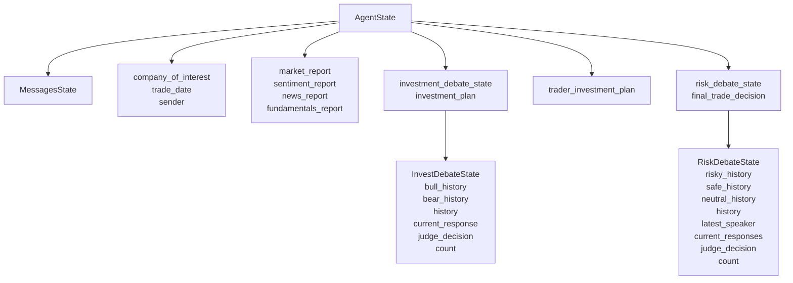

### Memory System Architecture

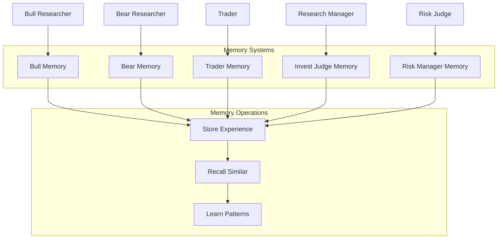

## LLM Integration

### LLM Provider Architecture

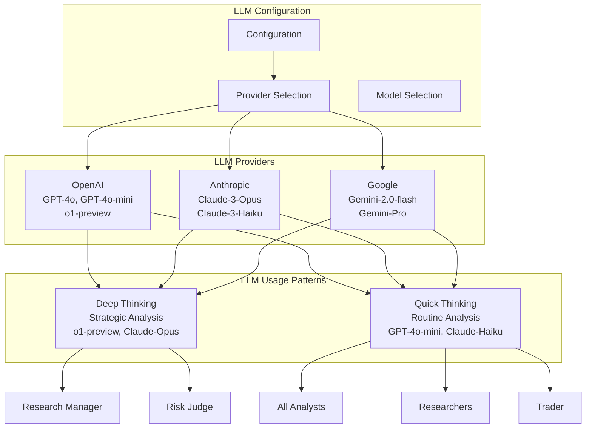

### Tool Binding and Execution

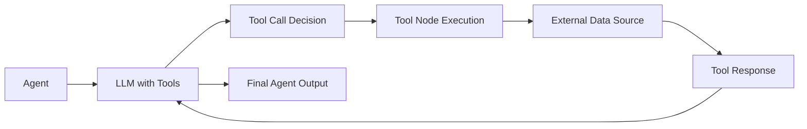

## Deployment Architecture

### Development Deployment

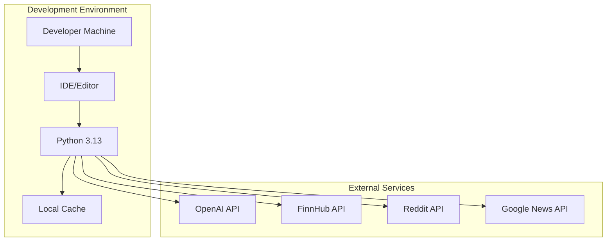

### Production Deployment

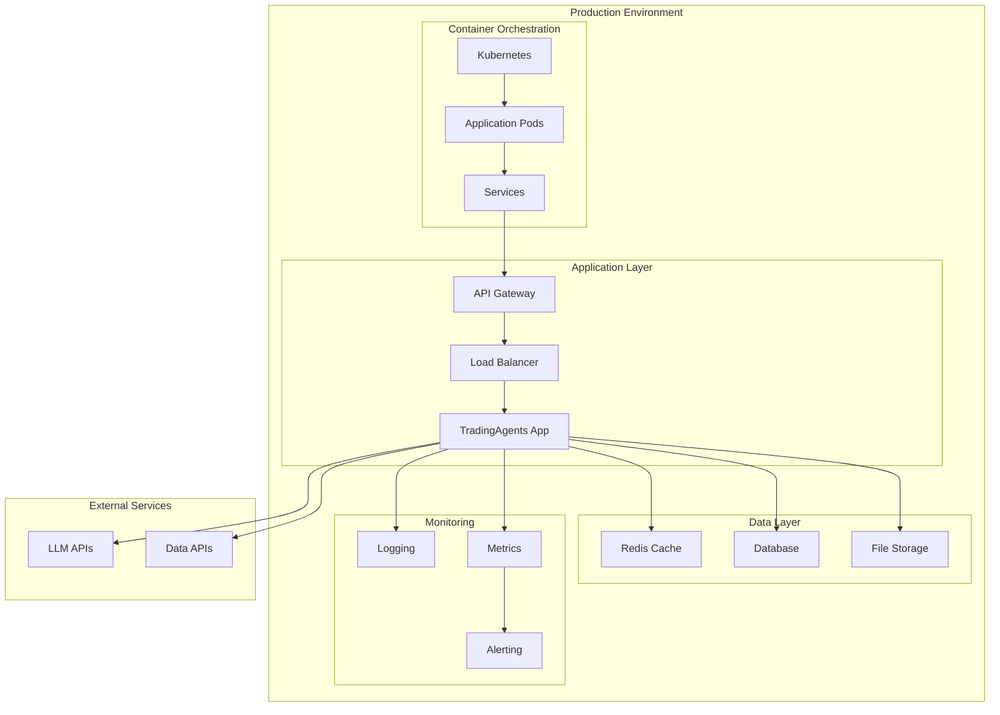

### Scalability Architecture

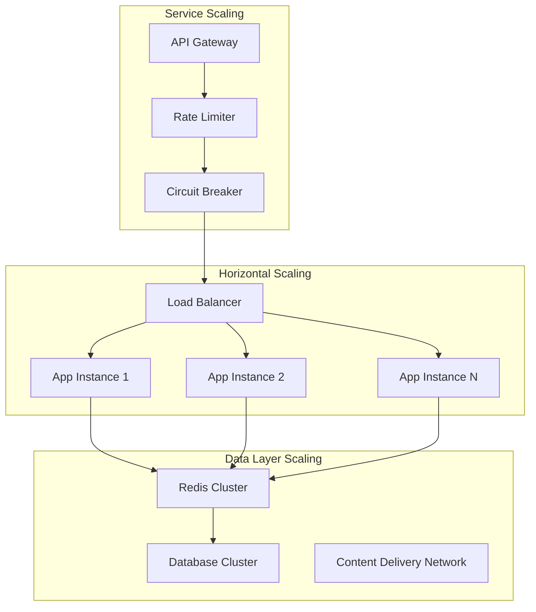

---

These architecture diagrams provide a comprehensive visual understanding of the TradingAgents framework structure, data flows, and deployment patterns. Use these diagrams as reference for development, debugging, and system design discussions.